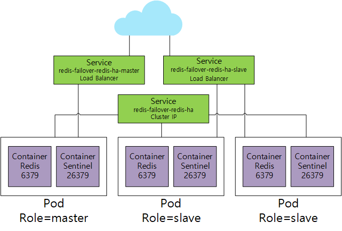
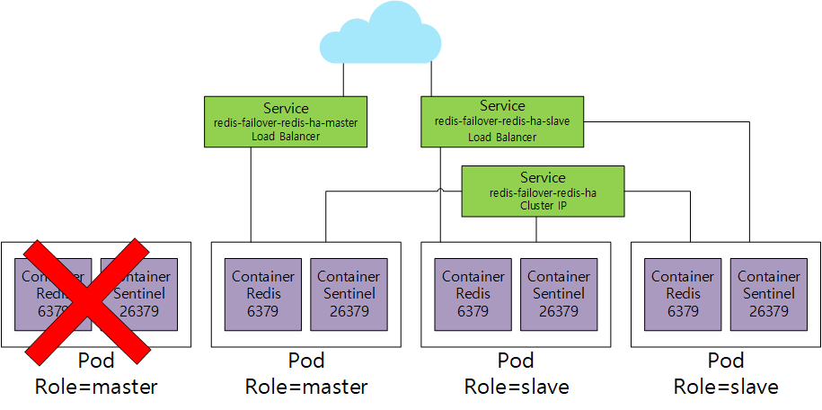

# Failover
## 목적 및 구성
- Redis sentinel을 이용해서 자동으로 Failover가 되게 구성해 동일한 Public Ip로 Master 및 Slave에 접속
- Sentinel에서 마스터가 선정되면 자동으로 kubectl명령을 통해 선정된 마스터 pod label에 role=master를 설정하고 나머지 pod label에 role=slave로 설정
- master service는 selector에 role=master, slave service는 selector에 role=slave를 설정해 master및 slave접속 구분
## 구성도
1. 초기 생성 시   
  
2. FailOver시 작동  
  
## StatefulSet 설정 작업
### StatefulSet
데이터 및 상태가 유지되어야 하는 애플리케이션을 실행하기위한 컨트롤러 
##### 주요 기능 
 - Pod 이름에 규칙성 부여: pod이름에 특정한 규칙성을 부여(redis-ha-0, redis-ha-1, ..)
 - 순차적 기동 : Pod이름 순서대로 실행해 Master 및 Slave 설정이 용이
 - 개별 Pod 디스크 볼륨관리: PVC 템플릿 형태로 pod마다 각각의 PV, PVC를 생성 및 관리 가능
```yaml
# (spec.template.spec)
      initContainers:
      {{- if .Values.sysctlImage.enabled }}
      - name: init-sysctl
        image: {{ template "redis.sysctl.image" . }}
        {{- if .Values.sysctlImage.mountHostSys }}
        volumeMounts:
        - name: host-sys
          mountPath: /host-sys
        {{- end }}
        command:
{{ toYaml .Values.sysctlImage.command | indent 10 }}
        securityContext:
          runAsNonRoot: false
          privileged: true
          runAsUser: 0
      {{- end }}
{{- if and .Values.hostPath.path .Values.hostPath.chown }}
      - name: hostpath-chown
        image: {{ .Values.image.repository }}:{{ .Values.image.tag }}
        securityContext:
          runAsNonRoot: false
          runAsUser: 0
        command:
        - chown
        - "{{ .Values.securityContext.runAsUser }}"
        - /data
        volumeMounts:
        - name: data
          mountPath: /data
{{- end }}
      - name: config-init
        image: {{ .Values.image.repository }}:{{ .Values.image.tag }}
        imagePullPolicy: {{ .Values.image.pullPolicy }}
        resources:
{{ toYaml .Values.init.resources | indent 10 }}
        command:
        - sh
        args:
        - /readonly-config/init.sh
        env:
{{- $replicas := int .Values.replicas -}}
{{- range $i := until $replicas }}
        - name: SENTINEL_ID_{{ $i }}
          value: {{ printf "%s\n%s\nindex: %d" (include "redis-ha.name" $) ($.Release.Name) $i | sha1sum }}
{{ end -}}
{{- if .Values.auth }}
        - name: AUTH
          valueFrom:
            secretKeyRef:
            {{- if .Values.existingSecret }}
              name: {{ .Values.existingSecret }}
            {{- else }}
              name: {{ template "redis-ha.fullname" . }}
            {{- end }}
              key: {{ .Values.authKey }}
{{- end }}
        volumeMounts:
        - name: config
          mountPath: /readonly-config
          readOnly: true
        - name: data
          mountPath: /data
```
* ConfigMap Mount, ConfigMap
```yaml
# Persistent Volume 사용 시
# (spec)
  volumeClaimTemplates:
  - metadata:
      name: data
      annotations:
      {{- range $key, $value := .Values.persistentVolume.annotations }}
        {{ $key }}: {{ $value }}
      {{- end }}
    spec:
      accessModes:
      {{- range .Values.persistentVolume.accessModes }}
        - {{ . | quote }}
      {{- end }}
      resources:
        requests:
          storage: {{ .Values.persistentVolume.size | quote }}
    {{- if .Values.persistentVolume.storageClass }}
    {{- if (eq "-" .Values.persistentVolume.storageClass) }}
      storageClassName: ""
    {{- else }}
      storageClassName: "{{ .Values.persistentVolume.storageClass }}"
    {{- end }}
    {{- end }}
# 임시 Volume 사용 시 
# (spec.template.spec.volumes)
{{- else }}
      - name: data
        emptyDir: {}
{{- end }}
```
* Persistant Volume 설정
## ConfigMap 수정을 통해 Failover작업 실행
###ConfigMap
각종 환경설정 및 변수와 초기화 파일을 Pod가 생성될때 미리 설정할 수 있는 저장소
##### 주요 기능 
 - 환경변수 값을 전달 : ConfigMap에서 설정한 환경변수 값을 Pod에 전달
 - 디스크로 Mount : ConfigMap에 설정한 파일을 디스크 형태로 Pod에 Mount해 각종 설정파일 및 스크립트 파일 전달

```yaml
  sentinel.conf: |
{{- if .Values.sentinel.customConfig }}
{{ .Values.sentinel.customConfig | indent 4 }}
{{- else }}
    dir "/data"
    {{- $root := . -}}
    {{- range $key, $value := .Values.sentinel.config }}
    sentinel {{ $key }} {{ $root.Values.redis.masterGroupName }} {{ $value }}
    {{- end }}
    # Failover 시 failover.sh스크립트 실행하도록 Sentinel 설정
    sentinel client-reconfig-script mymaster /data/conf/failover.sh
{{- if .Values.auth }}
    sentinel auth-pass {{ .Values.redis.masterGroupName }} replace-default-auth
{{- end }}
{{- end }}

  failover.sh: |
    #!/usr/bin/env sh
    FAILOVERIP=$6
    if [ -z "$FAILOVERIP" ]; then
        FAILOVERIP=$1
    fi
    echo $FAILOVERIP
    MASTERPOD=`getent hosts "$FAILOVERIP" |awk '{ print $3}'| awk -F '.' '{print $1}'`
    if [ -z "$MASTERPOD" ]; then
        echo "MASTER is Not Found"
    else
        /data/conf/kubectl label pod --all role=slave --overwrite -n {{.Release.Namespace}}
        /data/conf/kubectl label pod $MASTERPOD role=master --overwrite -n {{.Release.Namespace}}
    fi
    ...
  
  init.sh: |
    ...

        copy_config() {
        cp /readonly-config/redis.conf "$REDIS_CONF"
        cp /readonly-config/sentinel.conf "$SENTINEL_CONF"
        cp /readonly-config/failover.sh /data/conf/

        #### kubectl을 사용하기위해 추가된 행 ####
        wget -O /data/conf/stable.txt https://storage.googleapis.com/kubernetes-release/release/stable.txt
        wget -O /data/conf/kubectl https://storage.googleapis.com/kubernetes-release/release/`cat /data/conf/stable.txt`/bin/linux/amd64/kubectl
        chmod +x /data/conf/kubectl 
        #########################################

        # failover.sh의 실행권한 추가
        chmod +x /data/conf/failover.sh
    }

    setup_defaults() {
        echo "Setting up defaults"
        if [ "$INDEX" = "0" ]; then
            echo "Setting this pod as the default master"
            redis_update "$ANNOUNCE_IP"
            sentinel_update "$ANNOUNCE_IP"
            sed -i "s/^.*slaveof.*//" "$REDIS_CONF"
            ## 처음 생성 시 마스터 설정
            /data/conf/kubectl label pod $SERVICE-server-$INDEX role=master --overwrite -n {{.Release.Namespace}}  
        else
            ## 하나의 서비스로 모든 Pod에 접근하기 위해서 설정
            DEFAULT_MASTER="$(getent hosts "$SERVICE-server-0.$SERVICE.{{.Release.Namespace}}.svc.cluster.local" | awk '{ print $1 }')" 
            if [ -z "$DEFAULT_MASTER" ]; then
                echo "Unable to resolve host"
                exit 1
            fi
            echo "Setting default slave config.."
            redis_update "$DEFAULT_MASTER"
            sentinel_update "$DEFAULT_MASTER"
        fi
    }
    ...

```
* announce 서비스를 삭제해 불필요한 서비스 삭제
* master 서비스및 slave서비스를 추가해 master 및 slave에 구분되게 접속할 수 있게 구성함.
* 포드 IP를 통해 다른 포드의 이름을 알기 위해 전체 연결 서비스가 필요
* 여기에 추가적으로 announce서비스 삭제 및 master & slave서비스 추가작업 수행


# 결과
* 처음 생성 시 Statefulset이기 때문에 순서대로 생성되며, 첫번째 pod(redis-failover-ha-server-0)가 마스터로 선정된다.
```s
# 헬름을 통한 설치
helm install --name redis-failover --namespace redis-test ./
# 결과 확인
kubectl get po -w --show-labels -n redis-test
NAME                               READY   STATUS     RESTARTS   AGE   LABELS
redis-failover-redis-ha-server-0   0/2     Init:0/1   0          29s   app=redis-ha,controller-revision-hash=redis-failover-redis-ha-server-6dfcd4b66f,release=redis-failover,role=slave,statefulset.kubernetes.io/pod-name=redis-failover-redis-ha-server-0
redis-failover-redis-ha-server-0   0/2     Init:0/1   0          82s   app=redis-ha,controller-revision-hash=redis-failover-redis-ha-server-6dfcd4b66f,release=redis-failover,role=slave,statefulset.kubernetes.io/pod-name=redis-failover-redis-ha-server-0
## Role이 master로 변경됨
redis-failover-redis-ha-server-0   0/2     Init:0/1   0          83s   app=redis-ha,controller-revision-hash=redis-failover-redis-ha-server-6dfcd4b66f,release=redis-failover,role=master,statefulset.kubernetes.io/pod-name=redis-failover-redis-ha-server-0
redis-failover-redis-ha-server-0   0/2     PodInitializing   0          84s   app=redis-ha,controller-revision-hash=redis-failover-redis-ha-server-6dfcd4b66f,release=redis-failover,role=master,statefulset.kubernetes.io/pod-name=redis-failover-redis-ha-server-0
redis-failover-redis-ha-server-0   0/2     Running           0          85s   app=redis-ha,controller-revision-hash=redis-failover-redis-ha-server-6dfcd4b66f,release=redis-failover,role=master,statefulset.kubernetes.io/pod-name=redis-failover-redis-ha-server-0
redis-failover-redis-ha-server-0   1/2     Running           0          99s   app=redis-ha,controller-revision-hash=redis-failover-redis-ha-server-6dfcd4b66f,release=redis-failover,role=master,statefulset.kubernetes.io/pod-name=redis-failover-redis-ha-server-0
redis-failover-redis-ha-server-0   2/2     Running           0          100s   app=redis-ha,controller-revision-hash=redis-failover-redis-ha-server-6dfcd4b66f,release=redis-failover,role=master,statefulset.kubernetes.io/pod-name=redis-failover-redis-ha-server-0
redis-failover-redis-ha-server-1   0/2     Pending           0          0s     app=redis-ha,controller-revision-hash=redis-failover-redis-ha-server-6dfcd4b66f,release=redis-failover,role=slave,statefulset.kubernetes.io/pod-name=redis-failover-redis-ha-server-1
redis-failover-redis-ha-server-1   0/2     Pending           0          1s     app=redis-ha,controller-revision-hash=redis-failover-redis-ha-server-6dfcd4b66f,release=redis-failover,role=slave,statefulset.kubernetes.io/pod-name=redis-failover-redis-ha-server-1
redis-failover-redis-ha-server-1   0/2     Pending           0          5s     app=redis-ha,controller-revision-hash=redis-failover-redis-ha-server-6dfcd4b66f,release=redis-failover,role=slave,statefulset.kubernetes.io/pod-name=redis-failover-redis-ha-server-1
redis-failover-redis-ha-server-1   0/2     Pending           0          15s    app=redis-ha,controller-revision-hash=redis-failover-redis-ha-server-6dfcd4b66f,release=redis-failover,role=slave,statefulset.kubernetes.io/pod-name=redis-failover-redis-ha-server-1
redis-failover-redis-ha-server-1   0/2     Pending           0          15s    app=redis-ha,controller-revision-hash=redis-failover-redis-ha-server-6dfcd4b66f,release=redis-failover,role=slave,statefulset.kubernetes.io/pod-name=redis-failover-redis-ha-server-1
redis-failover-redis-ha-server-1   0/2     Init:0/1          0          15s    app=redis-ha,controller-revision-hash=redis-failover-redis-ha-server-6dfcd4b66f,release=redis-failover,role=slave,statefulset.kubernetes.io/pod-name=redis-failover-redis-ha-server-1
redis-failover-redis-ha-server-1   0/2     Init:0/1          0          86s    app=redis-ha,controller-revision-hash=redis-failover-redis-ha-server-6dfcd4b66f,release=redis-failover,role=slave,statefulset.kubernetes.io/pod-name=redis-failover-redis-ha-server-1
redis-failover-redis-ha-server-1   0/2     PodInitializing   0          88s    app=redis-ha,controller-revision-hash=redis-failover-redis-ha-server-6dfcd4b66f,release=redis-failover,role=slave,statefulset.kubernetes.io/pod-name=redis-failover-redis-ha-server-1
redis-failover-redis-ha-server-1   0/2     Running           0          91s    app=redis-ha,controller-revision-hash=redis-failover-redis-ha-server-6dfcd4b66f,release=redis-failover,role=slave,statefulset.kubernetes.io/pod-name=redis-failover-redis-ha-server-1
redis-failover-redis-ha-server-1   1/2     Running           0          106s   app=redis-ha,controller-revision-hash=redis-failover-redis-ha-server-6dfcd4b66f,release=redis-failover,role=slave,statefulset.kubernetes.io/pod-name=redis-failover-redis-ha-server-1
redis-failover-redis-ha-server-1   2/2     Running           0          110s   app=redis-ha,controller-revision-hash=redis-failover-redis-ha-server-6dfcd4b66f,release=redis-failover,role=slave,statefulset.kubernetes.io/pod-name=redis-failover-redis-ha-server-1
redis-failover-redis-ha-server-2   0/2     Pending           0          0s     app=redis-ha,controller-revision-hash=redis-failover-redis-ha-server-6dfcd4b66f,release=redis-failover,role=slave,statefulset.kubernetes.io/pod-name=redis-failover-redis-ha-server-2
redis-failover-redis-ha-server-2   0/2     Pending           0          0s     app=redis-ha,controller-revision-hash=redis-failover-redis-ha-server-6dfcd4b66f,release=redis-failover,role=slave,statefulset.kubernetes.io/pod-name=redis-failover-redis-ha-server-2
redis-failover-redis-ha-server-2   0/2     Pending           0          10s    app=redis-ha,controller-revision-hash=redis-failover-redis-ha-server-6dfcd4b66f,release=redis-failover,role=slave,statefulset.kubernetes.io/pod-name=redis-failover-redis-ha-server-2
redis-failover-redis-ha-server-2   0/2     Pending           0          10s    app=redis-ha,controller-revision-hash=redis-failover-redis-ha-server-6dfcd4b66f,release=redis-failover,role=slave,statefulset.kubernetes.io/pod-name=redis-failover-redis-ha-server-2
redis-failover-redis-ha-server-2   0/2     Init:0/1          0          10s    app=redis-ha,controller-revision-hash=redis-failover-redis-ha-server-6dfcd4b66f,release=redis-failover,role=slave,statefulset.kubernetes.io/pod-name=redis-failover-redis-ha-server-2
redis-failover-redis-ha-server-2   0/2     Init:0/1          0          49s    app=redis-ha,controller-revision-hash=redis-failover-redis-ha-server-6dfcd4b66f,release=redis-failover,role=slave,statefulset.kubernetes.io/pod-name=redis-failover-redis-ha-server-2
redis-failover-redis-ha-server-2   0/2     PodInitializing   0          51s    app=redis-ha,controller-revision-hash=redis-failover-redis-ha-server-6dfcd4b66f,release=redis-failover,role=slave,statefulset.kubernetes.io/pod-name=redis-failover-redis-ha-server-2
redis-failover-redis-ha-server-2   0/2     Running           0          53s    app=redis-ha,controller-revision-hash=redis-failover-redis-ha-server-6dfcd4b66f,release=redis-failover,role=slave,statefulset.kubernetes.io/pod-name=redis-failover-redis-ha-server-2
```
* 최종 생성 결과
```s
kubectl get po -n redis-test --show-labels
NAME                               READY   STATUS    RESTARTS   AGE     LABELS
redis-failover-redis-ha-server-0   2/2     Running   0          10m     app=redis-ha,controller-revision-hash=redis-failover-redis-ha-server-6dfcd4b66f,release=redis-failover,role=master,statefulset.kubernetes.io/pod-name=redis-failover-redis-ha-server-0
redis-failover-redis-ha-server-1   2/2     Running   0          8m20s   app=redis-ha,controller-revision-hash=redis-failover-redis-ha-server-6dfcd4b66f,release=redis-failover,role=slave,statefulset.kubernetes.io/pod-name=redis-failover-redis-ha-server-1
redis-failover-redis-ha-server-2   2/2     Running   0          6m30s   app=redis-ha,controller-revision-hash=redis-failover-redis-ha-server-6dfcd4b66f,release=redis-failover,role=slave,statefulset.kubernetes.io/pod-name=redis-failover-redis-ha-server-2
```
* 서비스에는  master서비스와 slave서비스가 로드 밸런서 형식으로 생성된다. 
```s
kubectl get svc -n redis-test
NAME                             TYPE           CLUSTER-IP     EXTERNAL-IP     PORT(S)                          AGE
redis-failover-redis-ha          ClusterIP      None           <none>          6379/TCP,26379/TCP               5m29s
redis-failover-redis-ha-master   LoadBalancer   10.0.38.168    52.231.78.248   6379:32682/TCP,26379:30944/TCP   5m29s
redis-failover-redis-ha-slave    LoadBalancer   10.0.204.158   52.231.70.179   6379:30517/TCP,26379:31255/TCP   5m29s
```
* master서비스는 read & write이고, slave서비스는 readonly이다.
```s
# master test
redis-cli -h 52.231.78.248
52.231.78.248:6379> set key1 value1
OK
52.231.78.248:6379> get key1
"value1"

# slave test
redis-cli -h 52.231.70.179
52.231.70.179:6379> set key2 value2
(error) READONLY You can't write against a read only replica.
52.231.70.179:6379> get key1
"value1"
```
* redis master pod 삭제작업 수행
```s
kubectl delete po redis-failover-redis-ha-server-0 -n redis-test
pod "redis-failover-redis-ha-server-0" deleted
```
* failover가 완료되어 마스터 포드가 변경됨
```s
kubectl get po -n redis-test --show-labels
NAME                               READY   STATUS    RESTARTS   AGE     LABELS
redis-failover-redis-ha-server-0   0/2     Running   0          35s     app=redis-ha,controller-revision-hash=redis-failover-redis-ha-server-6dfcd4b66f,release=redis-failover,role=slave,statefulset.kubernetes.io/pod-name=redis-failover-redis-ha-server-0
redis-failover-redis-ha-server-1   2/2     Running   0          9m46s   app=redis-ha,controller-revision-hash=redis-failover-redis-ha-server-6dfcd4b66f,release=redis-failover,role=slave,statefulset.kubernetes.io/pod-name=redis-failover-redis-ha-server-1
### Master로 선정된 pod
redis-failover-redis-ha-server-2   2/2     Running   0          7m56s   app=redis-ha,controller-revision-hash=redis-failover-redis-ha-server-6dfcd4b66f,release=redis-failover,role=master,statefulset.kubernetes.io/pod-name=redis-failover-redis-ha-server-2
```
* master read & write test
```s
redis-cli -h 52.231.78.248
52.231.78.248:6379> get key1
"value1"
52.231.78.248:6379> set key3 value3
OK
52.231.78.248:6379> get key3
"value3"
```